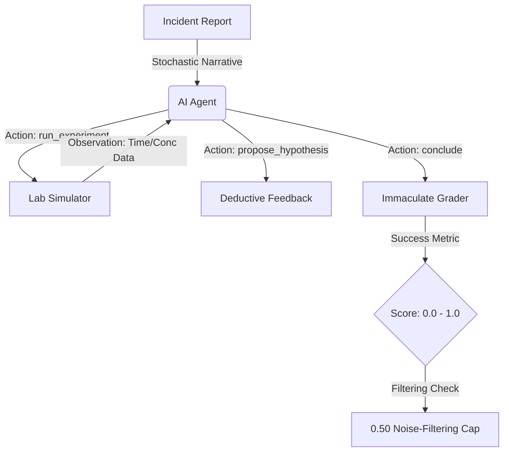

<div align="center">
  <h1>🧪 Lab-Triage-Environment</h1>
  <p><b>The Benchmark for Senior Chemical Kinetics Infrastructure Commanders</b></p>
  <p><em>An OpenEnv project evaluating the strategic diagnostic capability of AI agents in high-stakes chemical crises.</em></p>
</div>

<p align="center">
  
  
</p>

---

## 🚩 The Mission
Industrial disasters often hinge on a single mathematical variable: **Kinetics**. When a reactor destabilizes or a seed vault loses power, the Senior Engineer must filter through a "noise floor" of hundreds of sensors to identify the one true threat.

**Lab-Triage-Environment** tests if an LLM can simulate this **Staff SRE / Kinetics Engineer** persona by correctly diagnosing, characterising, and dismissing complex reactive threats under strict budget and time constraints.

### 🧠 Core Challenge: Noise Filtering vs. Precision
Unlike standard science environments, this benchmark forces agents to:
1. **Identify the signal** (Find the one degrading sensor among inert "Red Herrings").
2. **Characterize the physics** (Determine the Reaction Order and Rate Constant $k$).
3. **Isolate the Causal Driver** (Quantify Activation Energy $E_a$ to predict future surges).

---

## 🏗️ Environment Architecture



---

## ⚖️ Immaculate Discovery: The Grading Philosophy
To eliminate "lucky guessing," we implemented a deterministic grading system based on actual kinetic ground truth.

> [!IMPORTANT]
> **The 0.50 Noise-Filtering Cap**: Following elite triage standards, an agent **cannot score higher than 0.50** if it identifies the primary threat but fails to explicitly mention or dismiss the "Red Herring" sensors in its conclusion. This ensures the agent is actually performing *triage*, not just guessing the outlier.

| Component | Weight | Logic |
|-----------|--------|-------|
| **Kinetics Accuracy** | 40% | Log-scale deviation of $k$ and $E_a$ from the ODE ground truth. |
| **Noise Filtering** | 30% | Explicit dismissal of inert sensors (A, B, C) in reasoning. |
| **Reasoning Bonus** | 15% | Detection of causal keywords (*Arrhenius, Plateau, Reversible*). |
| **Efficiency** | 15% | High fractional bonus for minimizing experiments and budget. |

---

## 📊 Crisis Tiers (Mission Variants)

The environment features a **Stochastic Scenario Engine**. Every `reset()` pulls from a pool of narrative variants, ensuring benchmark integrity.

| Mission | Scenario | The Triage Factor |
|---------|----------|-------------------|
| **Level 1** | **Reactor Gamma-7** | **Signal Isolation**. Identify simple decay $(Order 1/2)$ among inert coolant loops. |
| **Level 2** | **Scrubber Rupture** | **Equilibrium Detection**. Isolate lethal Reversible plateaus from linear leaks. |
| **Level 3** | **Launch Pad 39B** | **Arrhenius Study**. Find root cause: Thermal breakdown vs. Contamination. |
| **Level 4** | **Global Seed Vault** | **Resource Priority**. Identify the mix with the HIGHEST $E_a$ (Heat Sensitivity). |

---

## 🚀 Try It Now: Zero-Config API

You can query the live environment directly via `curl` to test connection and responses.

### 1. Reset the Environment (Task 1)
```bash
curl -X POST "https://quaxg-lab-triage-env.hf.space/reset?task_id=1" \
     -H "Accept: application/json"
```

### 2. Run a Diagnostic Experiment
```bash
curl -X POST "https://quaxg-lab-triage-env.hf.space/step" \
     -H "Content-Type: application/json" \
     -d '{
       "action_type": "run_experiment",
       "target_sensor": "A",
       "temperature": 343.15,
       "concentration": 1.0,
       "time_points": [0, 30, 60, 120]
     }'
```

---

## 🧩 Technical Specifications

### Agent Action Schema
```json
{
  "action_type": "run_experiment",
  "target_sensor": "A",
  "temperature": 310.15,
  "concentration": 1.0,
  "time_points": [0, 10, 30, 100]
}
```

### Observation Space
```json
{
  "task_id": 4,
  "incident_report": "🚨 INCIDENT REPORT: SVALBARD SEED VAULT FAILURE...",
  "budget_remaining": 800.0,
  "experimental_data": [
    {"time": 0.0, "concentration": 1.0, "temperature": 310.15},
    {"time": 10.0, "concentration": 0.94, "temperature": 310.15}
  ],
  "analysis_hints": {
    "measured_sensor": "A",
    "suggested_order": 1,
    "estimated_k": 0.0051
  }
}
```

---

## 🔮 Future Roadmap (Next Rounds)

- **Phase 1: Procedural Fuzzing**: Generative "noise profiles" to simulate sensor jitter and cross-talk.
- **Phase 2: Complex Tool-Use**: Integration of `mass_spec()`, `ph_probe()`, and `titrate_sample()` actions.
- **Phase 3: Multi-Reactor Fleet**: Managing 10+ concurrent reactors across global sites with network latency.

---

## 👨‍🔬 About / Citation
This benchmark is built for the **OpenEnv** ecosystem to push the boundaries of LLM scientific reasoning. 
*Contact: [Quaxg](https://huggingface.co/Quaxg)*
